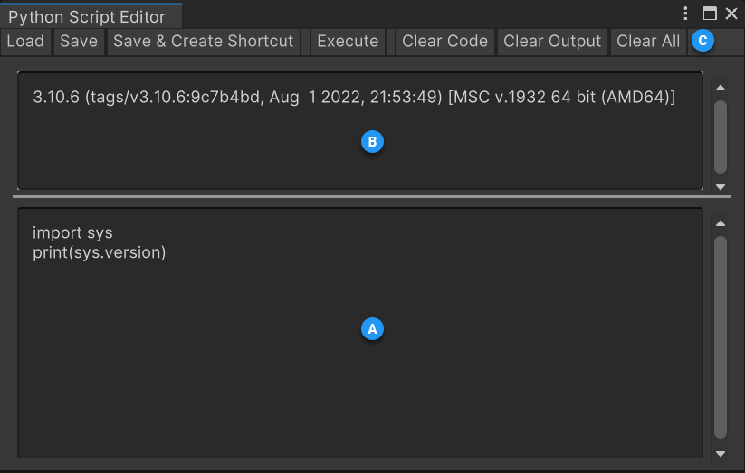
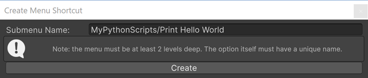

# Python Script Editor

The easiest way to start using Python for Unity is with the Python Script Editor:

You can type Python statements in the bottom window. Click on the `Execute`
button or type Ctrl-Return (Cmd-Return on macOS) to run the selected text.

Python `print` statements will appear in the upper window as well as in the Editor.log.

The load and save buttons allow reusing scripts.

`Save & Create Shortcut` adds a menu item to run the current script.

It does this by creating two files side by side: a C# file to create the menu
item, and a Python file which is a copy of your script in the Python Script Editor.
The menu item name needs to be unique. You will see an error in the Unity console if
you use an existing menu item name, and you will need to fix the C# file and modify
its `[MenuItem]`.

## Advanced Tool Programming

To implement more complex Python-based tools in Unity, there are two relevant APIs:
* The [in-process API](inProcessAPI.md) allows you to invoke Python code from
  C# that runs in the Unity process.
* The [out-of-process API](outOfProcessAPI.md) allows you to connect to an
  external application, e.g. a custom tool implemented in PySide.

## Limitations

Undo/redo is not implemented. Save often.

Sometimes, `print` statements stop printing in the Script Editor output. The workaround is to restart Unity.
