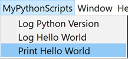

# Create a menu item that calls your script

Use the [Python Script Editor](ref-script-editor.md) to create a custom menu item that executes a Python script from the Unity Editor menu.

## Create a menu item

1. [Write or load](get-started.md) the desired script in the Python Script Editor.

2. Select **Save & Create Shortcut**.

   

3. Choose a name for the menu and submenu.

   * The menu must be at least 2 levels deep, the first level being at the root of the Unity Editor menu.

   * Ideally choose a first level menu name that you can reuse to group all your Python script menu items.

   * The menu item itself must have a unique name.

4. Select **Create**.

5. Save your script.

>[!NOTE]
>This action creates two files side by side:
>  * A C# file that creates the menu item and run your script [using RunFile](csharp-run-file.md)
>  * A Python file that is a copy of your script in the Python Script Editor

## Use the menu item

To use your new menu item and trigger the execution of your script:

1. From the main menu of the Editor, select your menu.

   

2. Select the menu item you want to execute.

## Additional resources

You can add menu items to existing Unity menus like GameObject, Assets or Window. For more information, see [scripting API documentation about Unity ­­­­`MenuItem`](https://docs.unity3d.com/ScriptReference/MenuItem.html).
