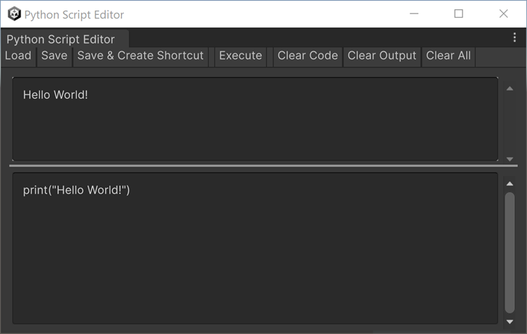

# Get started with the Python Script Editor

Use the [Python Script Editor](ref-script-editor.md) window to script in Python in the Unity Editor.

From there, Python for .NET gives you access to the whole Unity C# API (like `UnityEditor` and `UnityEngine` functionalities).

## Write and execute a simple Python script

1. From the Unity Editor main menu, select **Window** > **General** > **Python Script Editor**.

2. In the bottom section of the window, write your Python code.  
   For example, type in `print("Hello World!")`.

3. Select **Execute**.

## Save your Python script

To save the current Python script written in the bottom section in its own file:

1. Select **Save**.

2. In the pop-up window, name your script and choose where to save it.

3. Select **Save** again.

## Load a Python script

To load any Python script file in the Python Script Editor:

1. Select **Load**.

2. Browse the Python script you want to execute. You can load a script from anywhere.

3. Select **Open**.

You can then execute, debug, edit, and save the loaded script directly from there.
