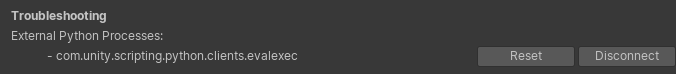
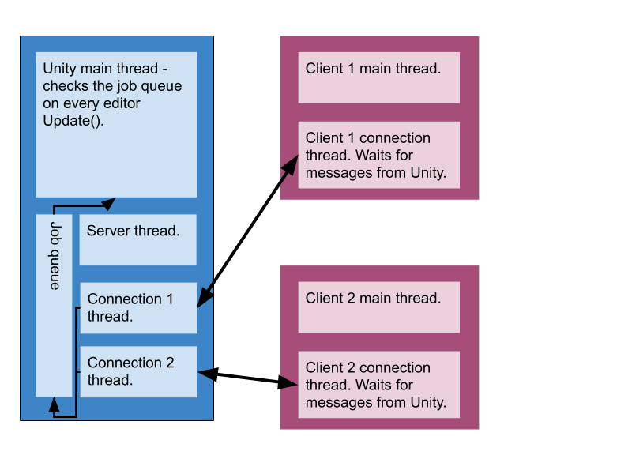

# Using the Out-of-Process API

The out-of-process API allows Python scripts to have a tight integration with
Unity but still run in a separate process. It's used typically to integrate
third-party packages.

The advantages of running a separate client process include:
* You can safely use Python modules implemented in native code that can't restart cleanly (many native modules can't).
* Your scripts aren't reset when Unity reloads the domain (e.g. when the user hits "play" or imports a new C# script).
* Unity continues to run even if your scripts cause a crash; users are less affected.
* Faster development: if you change your code, restart the client while leaving the rest of Unity unaffected.
* Manage versioning hell: you can use the module versions you need while another integration can use different versions without any clash.

## Troubleshooting

In the Python Settings, Troubleshooting section, each client that is connected to Unity will show up with its name and buttons to Reset or Disconnect. Reset will instruct the client to disconnect and try reconnecting. Disconnect will instruct the client to disconnect and, usually, to shut down.

## Examples

There are three examples packaged with Python for Unity that show how to implement clients depending on your use case. Their code provides most of the documentation of the API as of the present release.
Find them in the Samples directory of the package.
When you unpack samples via the Package Manager, a `Python` menu will open and let you run the examples.
* Eval/exec shows how Unity C# code can query information in a subprocess. The menu options let you send a message to the client to execute "x = 5", or to evaluate "x" (which will be 5 if you had run "x = 5" and will raise an exception if you hadn't).
* REPL Cilent shows how Python code in a client can query information from Unity. The menu option (not available on macOS) launches a python-like interactive console that lets you run commands on the server and prints global variables after each line.
* PySide Example shows how to get two-way communication between Unity and another application implemented in PySide.

## Limitations

The out-of-process API opens a localhost socket on a fixed port number (namely
port 18861). There is no supported way to change the port number.

Clients must run a version of Python 2.7. The patch version need not be
identical to the patch version that Unity finds for its in-process API, but
both must be 2.7.x. You cannot connect a client using Python 3.

Documentation about how to implement your own client is still a work in
progress. As of the present release, the best documentation is in the examples.

## Architecture

The following diagram illustrates the operational mode of the
Out-of-Process API:

The Unity process runs the server. It opens a localhost socket on port 18861.
This allows local users to connect to Unity, but not users elsewhere on the
internet. This server runs on its own thread, so it can serve clients quickly.

When spawned, clients then connect to the server. When a new client arrives,
the server creates a new thread for that connection. The new thread waits
for messages from that client exclusively. Similarly, on the client, a
thread waits for messages from the server.

Any thread on the server can call `PythonRunner.CallServiceOnClient` to send a message to
a particular client. Any thread on a client can call functions on the connection object
to send a message to Unity.
