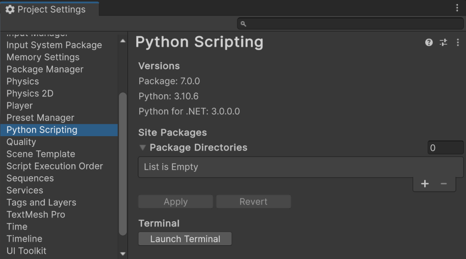

# Python for Unity Settings

You can find preferences for Python for Unity in the Project Settings under the
Edit menu.

The top of the window is useful information when looking for help to explain
exactly which version of the various components you are using.

The version of Python that runs [in-process](inProcessAPI.md) depends on your
system settings and cannot be changed via the Project Settings. It is displayed
for information purposes in the Project Settings. It is also displayed in
longer form in the Editor.log.

You can change the version of Python that normally runs
[out-of-process](outOfProcessAPI.md).  By default the field is blank, which
signals to find Python in your system PATH.  In the image above, taken on a
macOS machine, we are using the MacPorts Python. You can set this field to
Python interpreters that ship with various applications in order to easily use
their packages (see the macOS [installation instructions](installation.md) for
example). Changes are only applied after you restart Unity.

You can add site-packages that will be added to the `sys.path` to find
additional Python modules. Changes are only applied after you restart Unity.

If [out-of-process](outOfProcessAPI.md) clients have connected to Unity they
will show up in the Troubleshooting section. This helps understand whether
misbehaving clients are connected or not; and if so, it allows you to force
them to disconnect.

## Troubleshooting

In the troubleshooting section you can see all the clients that are connected
to Unity using Python for Unity.  If one of them is misbehaving, you can
`disconnect` from it, or `reset` (which disconnects from the client but invites
it to reconnect). You can also restart the server, which simultaneously resets
all the clients.

The troubleshooting section displays the path to the RPC socket being used. In
this version of Python for Unity there is no supported way to change that
socket: it is hard-coded in the file `settings.py`.

If, when resetting the server, you get an error relating to a lock file, or to
the socket address already being in use, check where there is another copy of
Unity running (perhaps in the background). Only one copy of Unity at a time can
use Python. Multiple different users on the same machine can each use one copy
of Unity.

The "rarely-needed" timeout is not likely to be useful. When you set the
External Python, the Python for Unity package executes it to discover which
version of Python it is (and to determine that it in fact Python). Normally the
response is nearly immediate; if it takes longer than the timeout, it is
assumed to not be Python. In the very unlikely case that Python takes longer
than 1 second to start up and report its version number on your system, you
will need to increase this timeout.

## Limitations

* On Windows, you must use Windows 10 build 1803 (spring 2018) or newer.
* Only one copy of Unity can run Python for Unity at a time per user, per machine.
* You cannot change the internal Python version.
* Paths are treated as verbatim strings. You will need to expand environment
  variables or (on macOS and linux) the `~` denoting the home directory.
